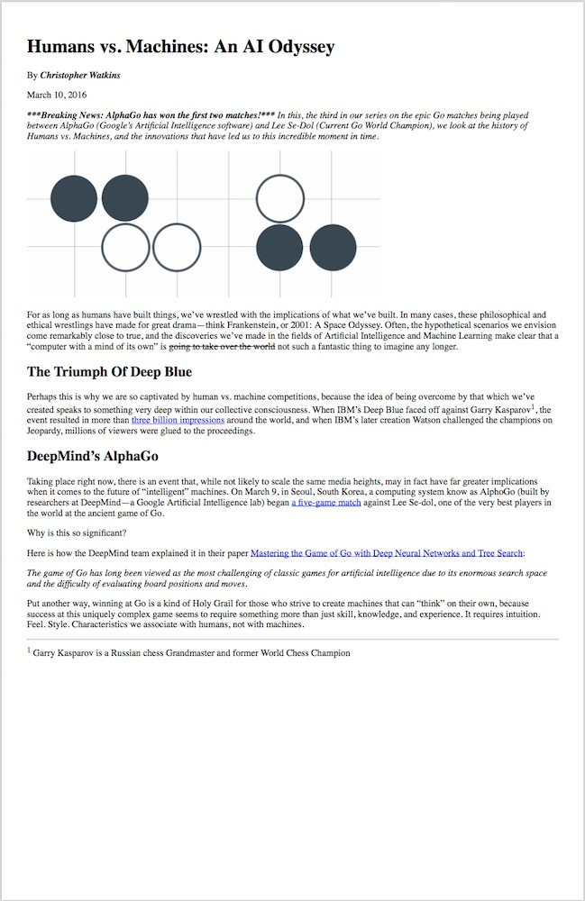
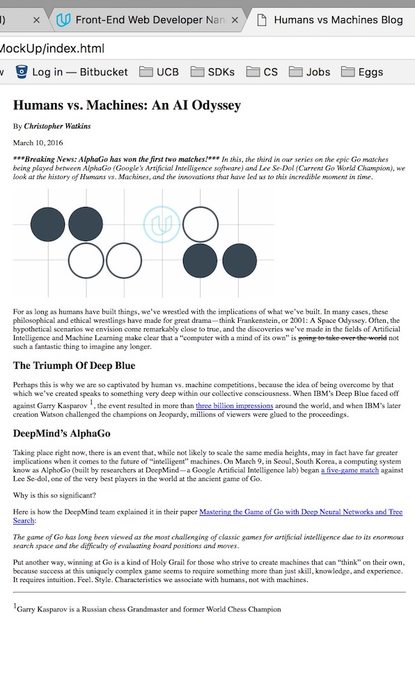

# Mockup to Article
> Udacity Frontend Nanodegree Project 1

This project is about creating an HTML replica of a PDF file. It is meant to simulate the progress that happens when a designer creates a mockup of a web page, and a developer has to transform that mockup into correctly semantic HTML.

## Usage
You can view the pdf that needs to be replicated [here](blog-mockup.pdf), and you can view my results by opening [index.html](index.html) file in your browser

#### PDF File Screenshot

	

#### HTML Result

	

