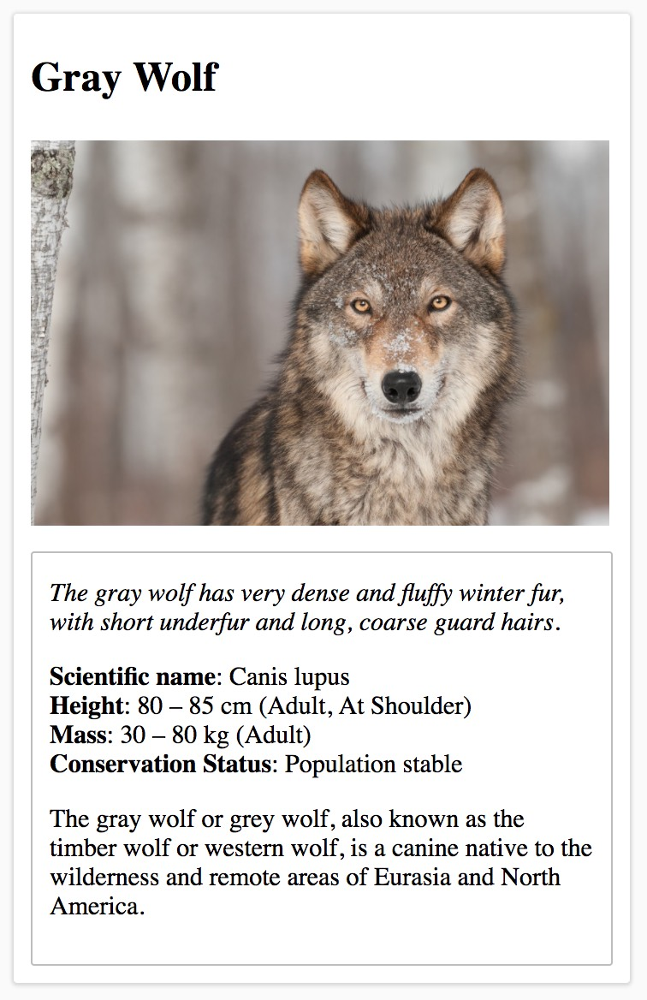

# Animal Trading Cards
> Udacity Frontend Nanodegree Project 2

This project is about creating an HTML template out of a PNG image. It is meant to simulate the progress that happens when a designer creates a mockup of a reuseable template, and a developer has to transform that mockup into correctly semantic HTML with CSS, and they have to provide real information to be displayed by the template.

## Usage
You can view the PNG that needs to be built [here](design-prototype.png), and you can view my results by opening [card.html](card.html) file in your browser

### Comparison

| PNG  | HTML |
|----|----|
|  |      |
