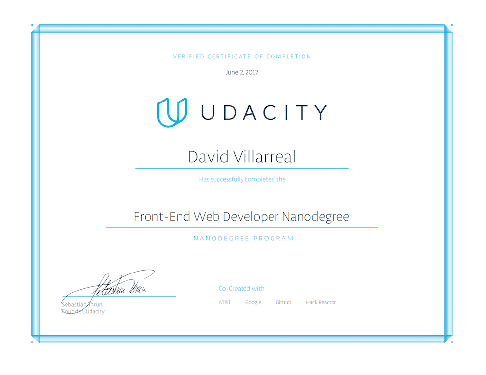

# Udacity Frontend Nanodegree Projects
These are the projects that I completed for the [Udacity Frontend Nanodegree](https://www.udacity.com/course/front-end-web-developer-nanodegree--nd001).

## Projects

1. [Mockup to Article](/Project1-MockUp/)
2. [Animal Trading Cards](/Project2-AnimalCards/)
3. [Portfolio Site](https://github.com/Phaze1D/Portfolio)
4. [Online Resume](https://github.com/Phaze1D/frontend-nanodegree-resume)
5. [Classic Arcade Game Clone](https://github.com/Phaze1D/frontend-nanodegree-arcade-game)
6. [Website Optimization](https://github.com/Phaze1D/frontend-nanodegree-mobile-portfolio)
7.  **[Neighborhood Map](https://github.com/Phaze1D/Google_Zomato_Maps)**
8. [Feed Reader Testing](https://github.com/Phaze1D/frontend-nanodegree-feedreader)

## Certificate of Completion

#### Dates
* February 15, 2017 - April 28, 2017
* *(Paused do to work)*
* May 28, 2017 - June 2, 2017
